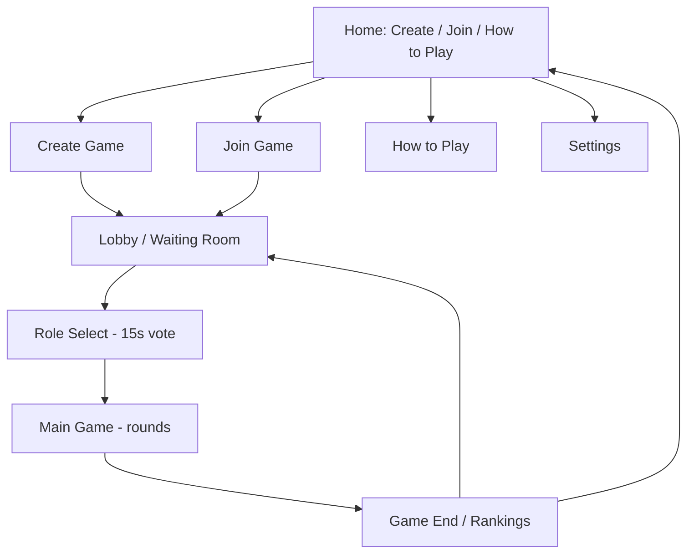

# Mastermind Online — Layout & UX

> **Status:** Draft, work in progress. Covers visual style, accessibility, and
> screen-by-screen layout for the responsive web app. See companion doc
> [game-rules.md](./game-rules.md) for the rules these screens implement.

## 1. Visual Style

- **Modern, flat UI** — no skeuomorphic pegboard/wood textures; clean shapes,
  flat colors, simple iconography.
- **Light and dark mode**, both supported, user-switchable.

## 2. Accessibility

- **Color-blind support:** every peg color is paired with a distinct
  **shape/symbol** (e.g. star, circle, triangle, square, diamond, cross) so
  color is never the only way to distinguish pegs. This applies everywhere a
  peg is shown — guess boards, palettes, and feedback pegs.
- Light/dark mode and color-blind mode are both toggleable from **Settings**
  (see §3.5).

## 3. Screen Flow

### 3.1 Home
- Three primary actions: **Create Game**, **Join Game**, **How to Play**.
- A **Settings** entry point (gear icon), always accessible.

### 3.2 Create Game (Host)
- Host picks **difficulty** (Easy / Moderate / Impossible) and **peg count**
  (4 / 6 / 8).
- On confirm, a room code is generated and shown prominently (large, easy to
  read/share), then the host is taken into the Lobby.

### 3.3 Join Game
- Two inputs: **room code** and **name tag**.
- Validation feedback inline (invalid code, duplicate name already taken in
  that lobby).

### 3.4 How to Play
- Static/scrollable explainer of the rules from game-rules.md, in
  player-friendly language (roles, rounds, feedback, winning).

### 3.5 Settings
- **Light / Dark mode** toggle.
- **Color-blind accessibility** toggle (enables shape/symbol overlays on
  pegs).

### 3.6 Lobby (Waiting Room)
- List of joined players (name tags) with a joined/ready indicator.
- Shows the chosen difficulty and peg count (read-only for non-hosts).
- Host sees a **"Start Game"** button (disabled until minimum players met);
  host can kick a player from this screen.
- Room code stays visible here for late joiners until the host starts.

### 3.7 Role Select
- Each player picks **Coder** or **Decoder**, with a visible **15s countdown**.
- Not picking defaults to Decoder.
- Brief result reveal (who's Coder) before transitioning into the Main Game,
  including the random pick/bot-added cases from game-rules.md §3.

## 4. Main Game Screen

Layout differs by role, but shares a persistent header: **round counter**
(e.g. "Round 3 / 10") and a **round timer** (countdown ring/bar). When the
timer hits zero, the current guess auto-locks: if the player hadn't pressed
Submit, their previous round's guess is reused automatically (per rules), and
any in-progress unsubmitted edits are discarded.

### 4.1 Decoder view
- **Own guess board**: large and central. Shows **full history** — every past
  round's guess as a row, stacking downward, each with its feedback (correct
  position / correct color counts), classic Mastermind style.
- **Guess input**: tap an empty peg slot in the current row → a color palette
  popup appears → tap a color to fill the slot. Repeat for all slots, then
  tap **Submit** to lock in the guess for the round.
- **Sidebar/strip** (no tabs): lists all other players' name tags with only
  their **latest round's feedback summary** (correct-position / correct-color
  counts) — never their actual guessed colors.

### 4.2 Coder view
- **Grid of all players' boards** shown at once, each showing that player's
  guesses (colors) and feedback, full history, updating live as the round
  resolves.
- No guess input for the Coder — pure spectator view.

## 5. Game End Screen

- Reveals the **secret code**.
- **Leaderboard/ranking** of everyone who cracked the code, ordered by
  earliest submission timestamp (1st, 2nd, 3rd, ...); if no one cracked it,
  shows the loss outcome with the Coder called out as winner.
- Actions: **Play Again** (back to Lobby, same room) or **Return to Home**.

## 6. Responsive Behavior

- **Mobile:** single-column, stacked layout. Own guess board on top, other
  players' feedback strip becomes a horizontally scrollable row beneath it.
  Coder's grid of boards stacks into a vertically scrollable list.
- **Tablet/Desktop:** side-by-side layout — own board large and central/left,
  other players' feedback sidebar on the right. Coder's grid uses actual
  multi-column grid (e.g. 2x2, 3x2) sized to number of players.
- Tap-based color palette (from §4.1) is the single input method across all
  breakpoints — no separate drag-and-drop variant needed.

## Not Yet Covered

- Tech stack and architecture
- Distribution / deployment (hosting, etc. for the web app)
