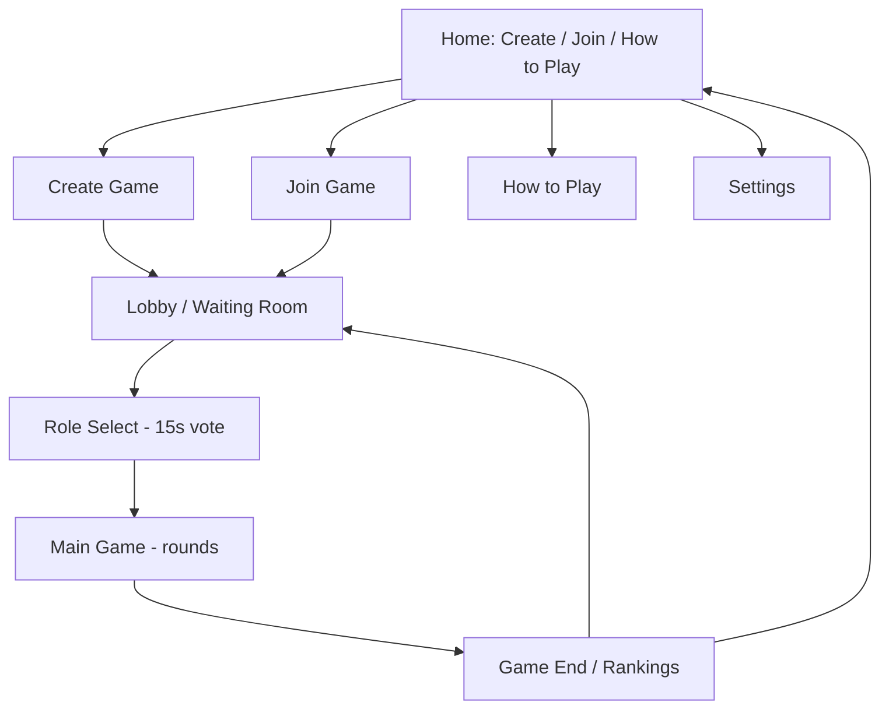

# Mastermind — Layout & UX

> **Status:** Draft, work in progress. Covers visual style, accessibility, and
> screen-by-screen layout for the responsive web app. See companion doc
> [game-rules.md](./game-rules.md) for the rules these screens implement.

## 1. Visual Style

- **Modern, flat UI** — no skeuomorphic pegboard/wood textures; clean shapes,
  flat colors, simple iconography.
- **Light and dark mode**, both supported, user-switchable.

## 2. Accessibility

- **Color-blind support:** every peg color is paired with a distinct
  **shape/symbol** (e.g. star, circle, triangle, square, diamond, cross) so
  color is never the only way to distinguish pegs. This applies everywhere a
  peg is shown — guess boards, palettes, and feedback pegs.
- Light/dark mode and color-blind mode are both toggleable from **Settings**
  (see §3.5).

## 3. Screen Flow

### 3.1 Home
- Three primary actions: **Create Game**, **Join Game**, **How to Play**.
- A **Settings** entry point (gear icon), always accessible.

### 3.2 Create Game (Host)
- Host picks **difficulty** (Easy / Moderate / Impossible) and **peg count**
  (4 / 5 / 6).
- On confirm, a room code is generated and shown prominently (large, easy to
  read/share), then the host is taken into the Lobby.

### 3.3 Join Game
- Two inputs: **room code** and **name tag**.
- Validation feedback inline (invalid code, duplicate name already taken in
  that lobby).

### 3.4 How to Play
- Static/scrollable explainer of the rules from game-rules.md, in
  player-friendly language (roles, rounds, feedback, winning).

### 3.5 Settings
- **Light / Dark mode** toggle.
- **Color-blind accessibility** toggle (enables shape/symbol overlays on
  pegs).

### 3.6 Lobby (Waiting Room)
- List of joined players (name tags) with a joined/ready indicator.
- Shows the chosen difficulty and peg count (read-only for non-hosts).
- Host sees a **"Start Game"** button (disabled until minimum players met);
  host can kick a player from this screen.
- Room code stays visible here for late joiners until the host starts.

### 3.7 Role Select
- Each player picks **Coder** or **Decoder**, with a visible **15s countdown**.
- Not picking defaults to Decoder.
- Brief result reveal (who's Coder) before transitioning into the Main Game,
  including the random pick/bot-added cases from game-rules.md §3.

## 4. Main Game Screen

Layout differs by role, but shares a persistent header: a compact **round
indicator** — a small filled circular badge with the current round number
(e.g. "3") followed by a muted "/10" — instead of a "Round 3 / 10" text
label, to keep the header lightweight. A compact **❌ "Leave Game" icon
button** sits at the far right of the header. Tapping it opens an in-app
confirmation dialog (progress will be lost) before returning to Home.

Directly below the header is a **round timer row**: a **depleting progress
bar** (fills the row, shrinks from full to empty as the round runs out) with
the **numeric seconds remaining** (e.g. "45s") shown next to it — the bar
gives an at-a-glance sense of pacing, while the number gives an exact count,
which matters most on short rounds (e.g. Impossible's 20s). The bar turns
from the accent color to a **warning/red color** once time is low (roughly
the final quarter of the round). Once the bar enters this low/red zone, the
numeric counter switches from whole seconds (e.g. "5s") to **hundredths of a
second** (e.g. "4.73s"), ticking down smoothly to add urgency/excitement in
the final stretch of the round; outside the low zone it shows plain whole
seconds. When the timer hits zero, the current guess auto-locks: if the
player had fully filled in every peg slot (even without pressing Submit),
that guess is auto-submitted on their behalf; if it was still incomplete,
their previous round's guess carries over instead (per rules). Either way
it's recorded as a timeout for that round.

### 4.1 Decoder view
- **Own guess board**: large and central. Shows **full history** — every past
  round's guess as a row, stacking downward, each with its feedback (correct
  position / correct color counts), classic Mastermind style.
- **One hint per game**: a 💡 bulb icon in the header (next to the ❌ Leave Game
  icon) arms "hint mode" — every peg in the current draft row glows to invite
  a tap. Tapping any peg reveals the secret color for that position and fills
  it in automatically; the glow then narrows to just that one peg for the
  rest of the round. Used exactly once per game — the bulb stays visible but
  disabled (greyed out, diagonal strike) afterward as a reminder it's spent.
- **Feedback legend**: a persistent legend below the guess board explains the
  feedback indicators: a **green dot** = correct color & position, a
  **yellow dot** = correct color but wrong position, a plain dot = no match.
  The **⏱ clock icon** on a history row (styled as a warning color, not a
  muted one) means that round's guess was either carried over or
  auto-submitted because Submit wasn't pressed in time — either way it counts
  as a timeout, so the icon doesn't distinguish which of the two happened.
- **Feedback circle positioning**: each row's feedback dots (and the ⏱
  timed-out icon, when present) are **right-aligned** within that row, on the
  same line as the row's pegs whenever there's room. All of a row's feedback
  dots render in a **single line** (never wrapping across peg counts of 4,
  5, or 6) so the row stays compact and easy to scan.
- **Guess input**: a color drawer is **always visible** pinned at the bottom
  of the screen (no popup/modal). The first color is pre-selected by default
  as soon as the guess board appears, so the very first peg tap always works
  immediately. Tap a color to select it — it highlights (enlarges slightly
  with an accent-colored ring) — then tap one or more peg slots to fill each
  with that color; the selection stays active across multiple taps (and
  across re-taps of the same swatch) so filling several pegs with the same
  color doesn't require re-selecting it each time — exactly one color is
  always selected. Tap **Submit** once every slot is filled to lock in the
  guess for the round.
- **Sidebar/strip** (no tabs): lists all other players' name tags with only
  their **latest round's feedback summary** (correct-position / correct-color
  counts) — never their actual guessed colors.

### 4.2 Coder view
- **Grid of all players' boards** shown at once, each showing that player's
  guesses (colors) and feedback, full history, updating live as the round
  resolves.
- No guess input for the Coder — pure spectator view.

## 5. Game End Screen

- Reveals the **secret code**.
- **Result banner**: a large icon + short message reflecting the *viewer's own* outcome — 🥇
  "You won!" for a winner (a cracker, or the Coder when nobody cracks it); otherwise one of
  😅/👏/🌟 for a loser, chosen by how close their final guess was (near-miss, rough round, or a
  solid middle-ground effort, respectively) — never a discouraging icon.
- The heading itself gets a matching icon too: a random 🎉/🎊 prefix on "Code Cracked!", or a 🔐
  prefix on "Out of rounds".
- **Final guess reveal**: each Decoder's **last submitted guess** is shown
  alongside its feedback (same row style as the guess board — pegs, feedback
  dots, carried-over icon), so players can see how close the final attempt
  was. In multiplayer, this is shown **for every Decoder**, not just the
  viewer's own guess.
- **Leaderboard/ranking** of everyone who cracked the code, ordered by
  earliest submission timestamp (1st, 2nd, 3rd, ...), each marked with 🥇; if
  no one cracked it, shows the loss outcome with the Coder called out (🥇) as
  winner.
- Actions: **Play Again** (back to Lobby, same room) or **Return to Home**.

## 6. Responsive Behavior

- **Mobile:** single-column, stacked layout. Own guess board on top, other
  players' feedback strip becomes a horizontally scrollable row beneath it.
  Coder's grid of boards stacks into a vertically scrollable list.
- **Tablet/Desktop:** side-by-side layout — own board large and central/left,
  other players' feedback sidebar on the right. Coder's grid uses actual
  multi-column grid (e.g. 2x2, 3x2) sized to number of players.
- Tap-based color palette (from §4.1) is the single input method across all
  breakpoints — no separate drag-and-drop variant needed.

## Not Yet Covered

- Tech stack and architecture
- Distribution / deployment (hosting, etc. for the web app)
